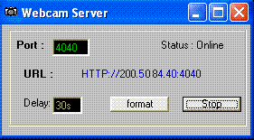



## Webcam server

### Description

Webcam server broadcast over the internet using the default web browser,image reloads every 30 seconds converts BPM to jpg, no dll's required, doesn't use  the clipboard.

Note: I used some of the code from PSC to do this project
 
### More Info
 

             |
---                |---
**Submitted On**   |2005-04-23 22:20:58
**By**             |[:: Carlo ::](https://github.com/Planet-Source-Code/PSCIndex/blob/master/ByAuthor/carlo.md)
**Level**          |Intermediate
**User Rating**    |4.6 (37 globes from 8 users)
**Compatibility**  |VB 6\.0
**Category**       |[Internet/ HTML](https://github.com/Planet-Source-Code/PSCIndex/blob/master/ByCategory/internet-html__1-34.md)
**World**          |[Visual Basic](https://github.com/Planet-Source-Code/PSCIndex/blob/master/ByWorld/visual-basic.md)
**Archive File**   |[Webcam\_ser1880434232005\.zip](https://github.com/Planet-Source-Code/carlo-webcam-server__1-60176/archive/master.zip)

